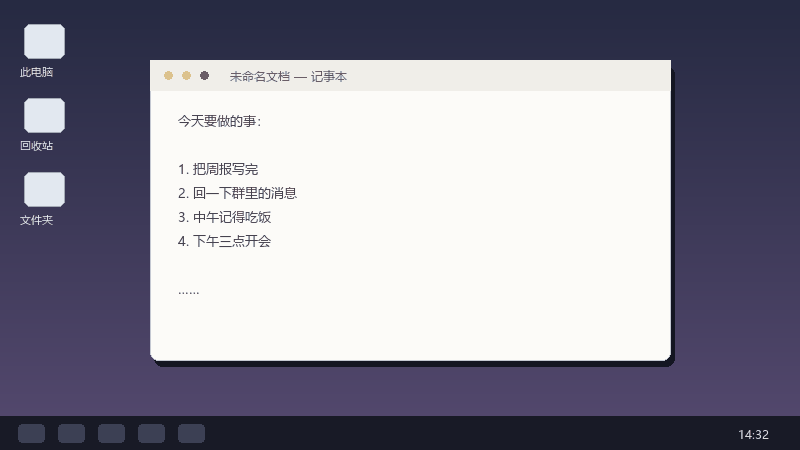
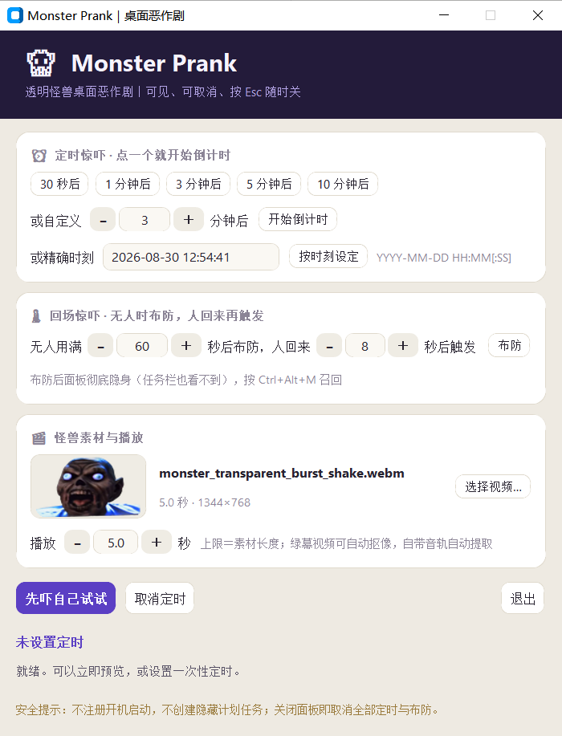
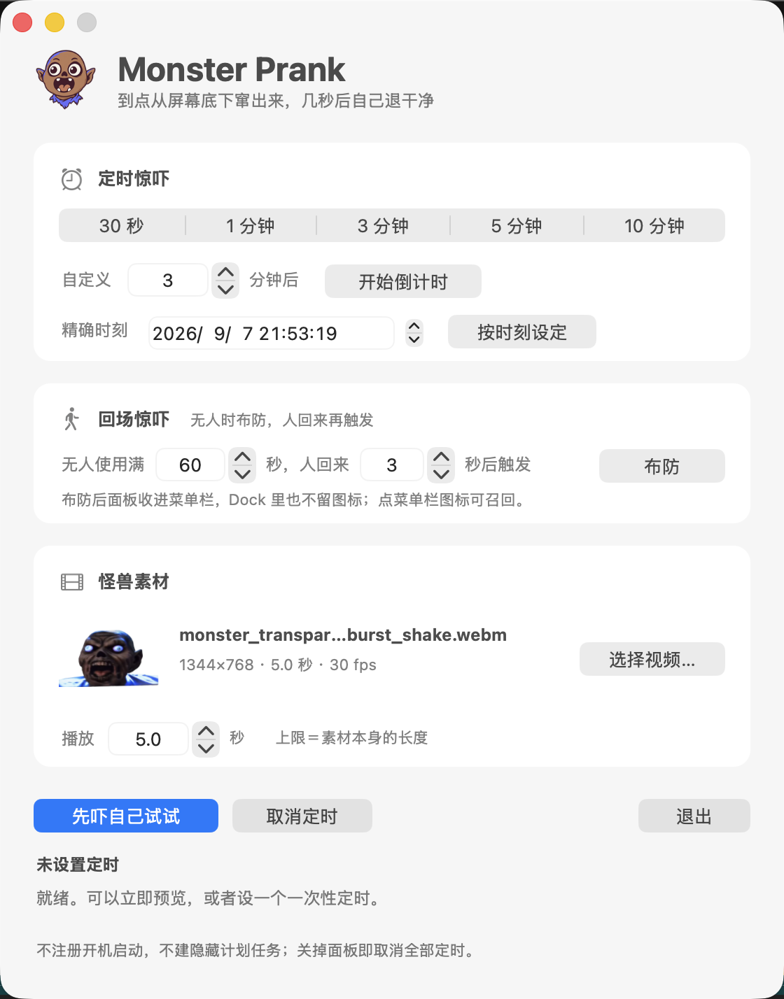

<div align="center">


# Monster Prank

一个 Windows 与 macOS 的屏幕恶作剧工具。到设定的时间，一只怪兽会从屏幕底部窜上来叫一声，大约五秒后程序自己退出。

<p><b>简体中文</b> · <a href="README.en.md">English</a></p>

<p>


</p>



</div>

## 功能与触发方式

<table>
<tr>
<td></td>
<td></td>
</tr>
<tr><td align="center">Windows</td><td align="center">macOS</td></tr>
</table>

两个平台的功能一样，界面各按各的系统来：Windows 是自绘的卡片，macOS 用原生控件，跟随系统的浅色深色和强调色。

控制面板提供三种触发方式：

- **立即播放**：用于预览效果，播放完成后程序不会退出。
- **定时触发**：支持选择预设时间（30 秒、1 分钟、3 分钟、5 分钟、10 分钟），也可以输入自定义分钟数或指定具体时刻（精确到秒）。
- **空闲触发**：在电脑无操作满 N 秒后进入待命状态；重新检测到键盘或鼠标活动后，延迟 M 秒播放。

### 运行机制

- 设定定时后 3 秒，控制面板会自动隐藏。Windows 上连任务栏都不显示，macOS 上会收进菜单栏、同时从程序坞消失。
- 重新调出面板：Windows 按 `Ctrl + Alt + M`，macOS 点菜单栏上那个小图标。调出面板不会中断已设定的定时。
- 直接关闭控制面板会取消全部定时。
- 视频播放过程中按 `Esc` 键可立即停止播放并退出。
- 多显示器环境下，视频仅在主屏幕全屏覆盖播放。

## 自定义素材

点击面板上的“选择视频…”可以更换播放素材：

- **透明通道视频**：带透明通道的视频格式载入后可直接使用。
- **绿幕视频**：无透明通道的视频载入时，程序会自动读取画面四角的背景色，并提示是否按该颜色抠除背景。
- **音频**：如果视频同目录下存在同名的 `_audio.wav`，程序会优先调用该音频；若无独立音频文件，则自动提取视频内的自带音轨。

## 下载与运行

### Windows 10 / 11

1. 下载 [**MonsterPrank-windows.zip**](https://github.com/AppApp777/monster-prank/releases/latest/download/MonsterPrank-windows.zip)（49 MB）。
2. 解压压缩包，双击运行 `MonsterPrank.exe`。
3. `MonsterPrank.exe` 要读同目录下的 `_internal` 和 `assets` 两个文件夹，不能单独拖出来放到别处。双击之后没有任何反应、或者黑框一闪就消失，多半就是这个原因。

首次运行时，系统可能会弹出“Windows 已保护你的电脑”提示框。点击“更多信息”，再点击“仍要运行”即可。该提示是因为程序没有做代码签名，微软无法识别发布者，并非检测到病毒。

### macOS（Apple 芯片）

1. 下载 [**MonsterPrank-macOS.zip**](https://github.com/AppApp777/monster-prank/releases/latest/download/MonsterPrank-macOS.zip)（40 MB）。
2. 解压后把 `MonsterPrank.app` 拖进“应用程序”。
3. **第一次打开要右键点图标、选“打开”，再在弹窗里点一次“打开”**；直接双击会被系统拦下，提示无法验证开发者。原因同上：程序没做代码签名和公证，不是检测到病毒。

包里只有 arm64，**Intel 芯片的 Mac 用不了**，那种情况请按下面“从源码运行”自己跑。
另外这个包只在 macOS 26 上实测过，更早的系统我没有机器可以验。

Release 页面提供了 `SHA256SUMS.txt`，可用于核对下载文件的哈希值以确认完整性。

## 系统行为与卸载

- 程序不联网、不开机自启、不修改注册表与系统设置、不收集任何用户数据。
- 卸载时直接删除解压出的程序文件夹即可，系统内无任何残留文件。

## 许可与版权

- 程序源代码采用 [MIT](LICENSE) 协议开源。
- 默认自带的怪兽视频、音效及 logo 由 AI 工具生成，生成时使用的网络参考图未记录原始来源。我不主张相关形象权利，按现状提供。若相关权利人对此有异议，请在 Issues 中反馈，我会撤下并替换对应素材。如需商用或二次分发，建议先替换为自有素材。
- 详细说明请参阅 [ASSET_LICENSE.md](ASSET_LICENSE.md)。

## 问题反馈

用着有问题或者有建议，开一个 [Issue](https://github.com/AppApp777/monster-prank/issues) 就行。

## 关于作者

七也。做的事情是去试那些没人讲清楚的东西，然后讲清楚。日常发在这两个地方：

| 抖音 | 小红书 |
|:---:|:---:|
|  |  |
| 七也 · `miao1162603325` | 七也 · `5441921009` |

## 更新记录

见 [CHANGELOG.md](CHANGELOG.md)。

---

<details>
<summary><b>给开发者的：从源码运行和自己打包</b></summary>

### 从源码跑

Windows 需要 Python 3.10+（带 Tk）；macOS 只用得上 PyObjC，界面和叠加窗都不走 Tk。

```bash
python -m pip install Pillow av
python -m pip install customtkinter                                   # 只有 Windows 界面要
python -m pip install pyobjc-framework-Cocoa pyobjc-framework-Quartz   # 只有 macOS 要
```

```bash
python monster_prank.py            # 打开面板
python monster_prank.py --check    # 自检素材和解码器
python monster_prank.py --demo     # 放一遍就退出
```

Windows 也可以直接双击 `run_monster_prank.bat`，macOS 用 `run_monster_prank.command`。

### 自己打包

```bash
python -m pip install -r packaging/requirements-build.txt
powershell -ExecutionPolicy Bypass -File packaging/build_windows.ps1
bash packaging/build_macos.sh
```

PyInstaller 不能在 Windows 上交叉构建 macOS 应用，mac 包必须在 Mac 上打。

### 目录

| | |
|---|---|
| `monster_prank.py` | 全部程序代码 |
| `assets/` | 默认素材（webm ＋ 首帧海报 ＋ 缩略图 ＋ wav ＋ 元数据） |
| `packaging/` | 两个平台的打包脚本、版本署名、构建依赖 |
| `asset-src/` | 怪兽素材的生成脚本与当初用的提示词 |
| `docs/` | 开发进度与 bug 历史 |

### 几个踩过的坑

- **带 Alpha 的 VP9 必须强制走 `libvpx-vp9` 解码器**。FFmpeg 原生的 `vp9` 解码器会
  **静默丢掉透明通道**，不报错，表现是透明区域变成黑色。
- `UpdateLayeredWindow` 收的是**预乘 Alpha**，而且预乘必须在缩放之前做，否则边缘发白。
- 首帧海报和面板缩略图**不是同一张图**：海报必须等于视频第 0 帧（否则起播会跳），
  而这一版素材的第 0 帧怪兽还没窜进画面，拿它当缩略图卡片上是一片空白。
- `packaging/build_windows.ps1` **必须保持纯 ASCII**：PowerShell 5.1 把没有 BOM 的
  `.ps1` 当 ANSI 读，一句 UTF-8 中文注释会吃掉后面那个换行，把下一行也注释掉。

</details>
